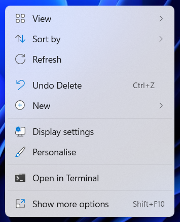
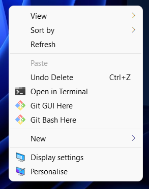

# Update Windows 11 Menu
This code makes it so that every time you right click in
windows 11 it automatically goes to the "show more options"
menu rather than the annoying simplified one.

## Usage
In order to use the program, simply download the [update_windows_11_menu.exe](update_windows_11_menu.exe) file and run it on your machine. After it has run, simply restart your machine and the changes will take effect.

## Before
When right clicking: 

## After
When right clicking: 

